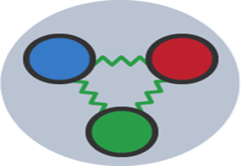
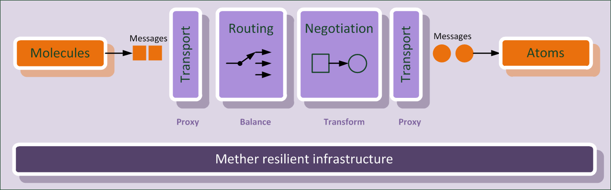

#  Mether

Mether is a resilient secure distributed application platform using analogies from physics, hence the name created from :
* Matter, any substance made up of elementary building blocks such as quarks.
* Ether, a postulated medium for the propagation of non-mechanical interactions.

A Mether is also a communal or *Friendship* drinking vessel from the Celtic tradition, visitors were formally welcomed in 'peace and friendship' with a mether, just like we want to welcome you to this community. While the original utility of analogies was generative – producing a model that explained how it works - the analogy is also useful to communicate to new comers or non-developers about the project. 

## Objectives

Usually, applications are designed to be deployed knowing the state of the underlying infrastructure. This means that each time the state of the infrastructure changes the application configuration needs to be updated, leading to what is commonly refered as the *configuration hell*. Indeed, from the point of view of the application developer the infrastructure details such as IP addresses, network connectivity, discovery, messaging, etc. should be hidden and the deployment experience should be portable.

Mether provides a new paradigm where the application *shapes* the infrastructure as required just like a man shapes the physical world to create his tools. It means that Mether is a stateless infrastructure that auto-detect, auto-configure, auto-respond, auto-heal, auto-scale according to application requirements. Mether can be seen as an **Infrastructure over Infrastructure (IoI)** because it creates a *virtual private infrastructure* for your application *inside* an existing infrastructure. Hiding how infrastructure achieved this behind a simple API, we believe resilient applications should be built and distributed more easily.

Resilience is the conjunction of different factors that can be seen as guidelines :
* Open Source components
* Node diversity (e.g. geographic, jurisdictional, operating systems, etc.)
* Data integrity
* Stealth (no identifiable point of failure and topology)

## Basic concepts

In Physics, a *quark* is an elementary particle and a fundamental constituent of matter. In Mether, a quark is an elementary chunk of data and a fundamental constituent of information. Like in Physics, there are different types of quarks known as flavors : files, events, logs, etc. Quark content addressing is based on cryptographic-hashes allowing integrity checking and providing wide, secure, trustless exchanges of data. 

In Physics, a *hadron* is a composite particle made of quarks held together. In Mether, quarks can similarly be grouped in hadrons and manipulated as a batch. Hadrons are created using non-hierarchical metadata assigned to a piece of information, like tags or labels, which allows a data to be described and found again by searching. 

In Mether, *atoms* are the smallest constituent unit of application functions that can reliably be moved from one computing environment to another, a.k.a. containers, functions or micro-services. The ability of atoms to associate and dissociate is responsible for most of the physical changes observed in nature, and is the subject of the discipline of chemistry.

In Physics, a *molecule* consists of a stable system composed of two or more atoms exhibing specific properties. In Mether, molecules adds a higher level of abstraction to atoms, which are containerized components. A molecule composes several existing fine-grained components into a single higher order composite element, which can be typically seen as an application, in order to achieve the appropriate "granularity" while promoting reuse and manageability of the underlying components.

In Physics, atoms interact, form molecules, and manifest further properties through interactions and force carriers or messenger particles of underlying fields. In Mether, application components interact through a *serverless messaging system* supported by a field of computers. In Physics, different exchange forces do exist e.g. the color force for quarks, the strong force for hadrons, the electromagnetic force for atoms and molecules. In Mether different built-in message exchanges do exist between each type of constituent at each scale.

## Working with Mether

The implementation of Mether is based on a message-oriented middleware used by the application to send commands to the infrastructure thanks to a simple protocol similar to [JSON-RPC](http://www.jsonrpc.org/specification). Then, the infrastructure ensures the transport protocol negotiation between the multiple formats supported by atoms (such as HTTP or JDBC). Mether is designed to avoid unecessary layers so that the parameters of the messages are directly formatted according to what is required by the underlying technologies (e.g. container engine or database). It acts as a proxy and a load balancer for all requests/responses between the molecule and underlying atoms.

<p align="center">

<i>How messaging works between a molecule and the infrastructure to reach an atom</i>
</p>

Every molecule (i.e. application)  expresses its requirements with regard to the infrastructure with a `Metherfile.json` file which holds all required quarks in a hash and a signature generated using the molecule owner's private key. If the molecule owner (who has the private key for the molecule hash) modifies the molecule, then he/she signs a new `Metherfile.json` and publishes it to the infrastructure. Afterwards, the infrastructure verifies the `Metherfile.json` integrity (using the signature) and convert it into a set of command messages in order to :
* download the modified quarks required by each atom (a.k.a. container images),
* create the atoms required by the molecule (a.k.a. container instances or microservices).

Example `Metherfile.json` file is given hereafter:
```json
{
 "hash": "1TaLkFrMwvbNsooF4ioKAY9EuxTBTjipT",
 "name": "MyMolecule",
 "description": "Decentralized application with Mether",
 "atoms": {
  "webapp": {
   "hash": "1baeab2b22dca59d434800b5ffcbcf470520dc7f2eee7ee4a0a7ebc7e87468ef",
   "size": 1073741824,
   "replicas": 2
  },
  "database": {
   "hash": "c1642cc2922a74c3e74991f0194e2acc46dc5e003207a0028dad63c75c41a0ec",
   "size": 1073741825
  }
 },
 "modified": 1479332094.372,
 "signers": [
  "HG/6ljsXbej7laqD3JUGsa8IEgSGE+NZs2jg9reQ3vrlo0fTnoFESCNujVxRuY1ORor143LGSyjl8PkaRdU4gx8="
  ],
 "signs": [
  "HOHLv0kUdd3iEacj6658ILDxB0hpS5ND/g1Z8JSXusl+QelydhZpINcEra61qNpsTBxqxpleE7tbkqG1J59YhZo="
 ],
 "mether_version": "0.5.0"
}
```

Once deployed to the infrastructure by the Mether CLI you will be able to reach your application entry point using
  `http://127.0.0.1:3003/{molecule_hash}` (eg.
  `http://127.0.0.1:3003/1TaLkFrMwvbNsooF4ioKAY9EuxTBTjipT`).
Mether also provide an hybrid Mobile or Desktop client.

The molecule acts as a local proxy talking for you to the infrastructure so that there is no identifiable entry point such as domain names.

In Mether, just like in nature, anything has a TTL (Time-To-Live) so that atom desappear form the infrastructure when no longer required and pop up when required again. 

## Candidate underlying technologies

* Distributed data storage to support Matter like
 * https://ipfs.io/
 * https://github.com/datproject/dat
 * https://github.com/mafintosh/hyperdrive
 * https://github.com/bigchaindb/bigchaindb
 * https://github.com/haadcode/orbit-db
 * http://orientdb.com/
* Distributed messaging to support Ether like
 * http://kafka.apache.org/
 * http://nsq.io/
 * https://github.com/edwardchoh/zmqbus-node
* Container manager to support Atoms like
 * https://www.docker.com/ 
 * http://kubernetes.io/
* Distributed internet as inspiration
 * https://github.com/HelloZeroNet/ZeroNet


